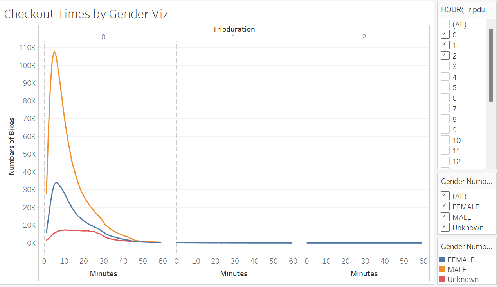
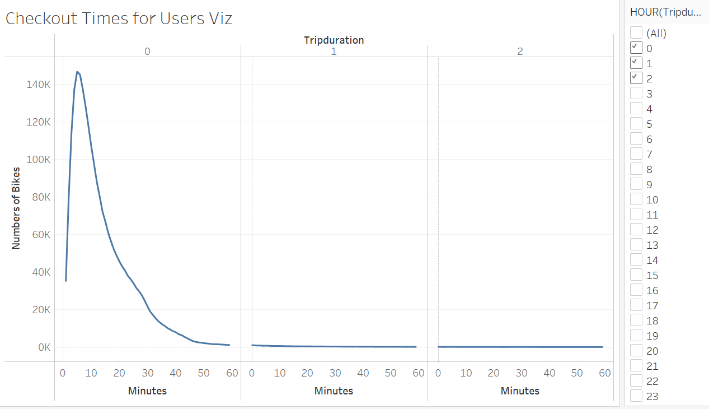
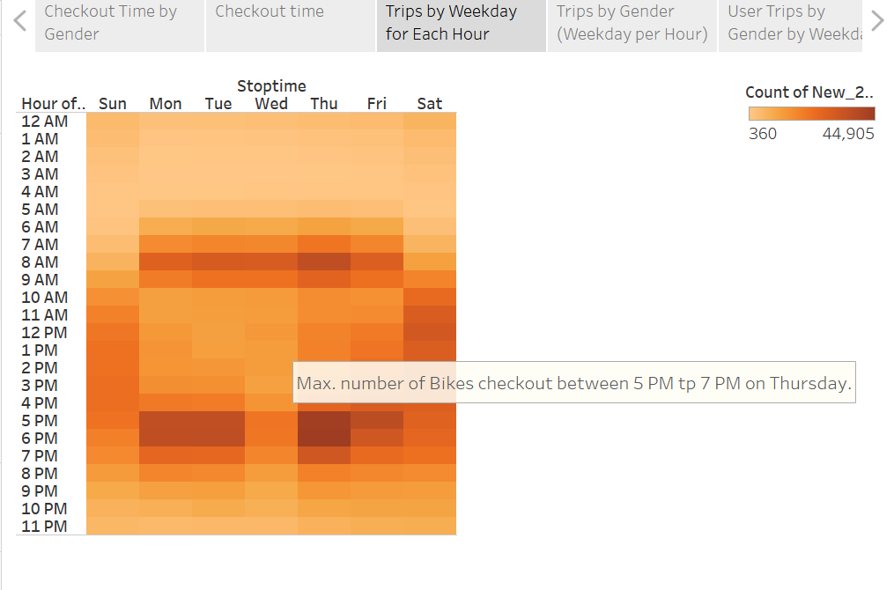
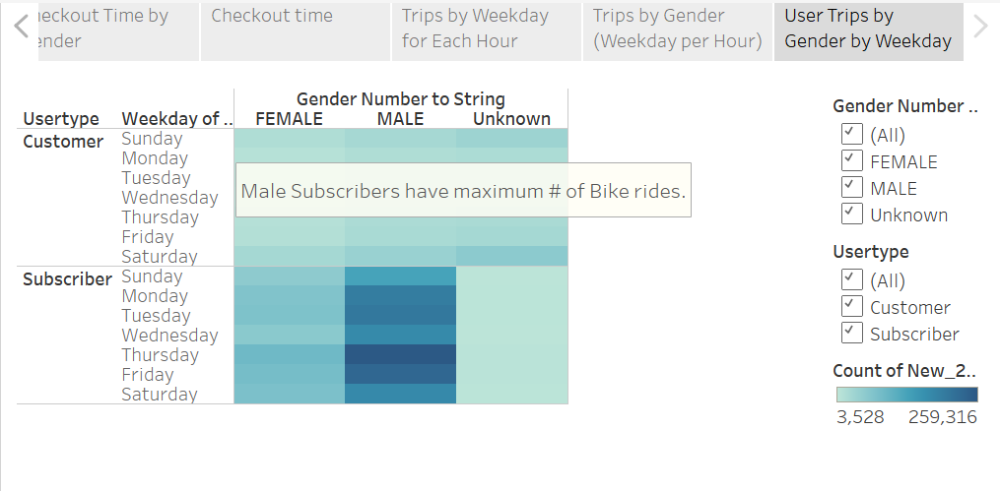
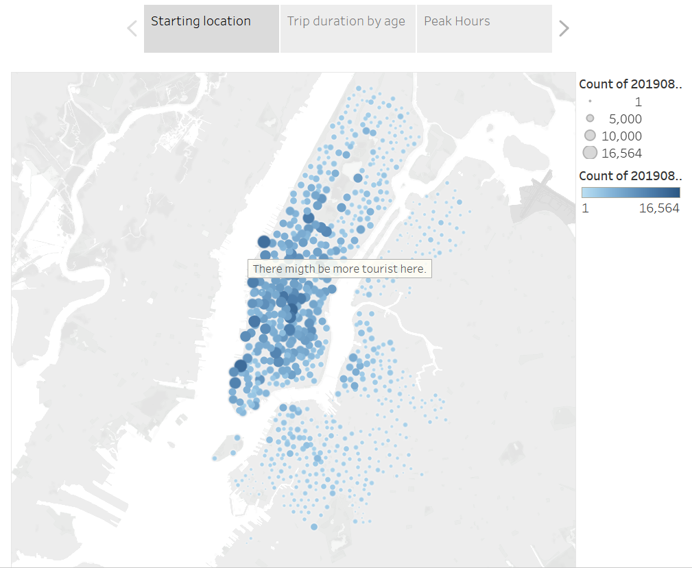
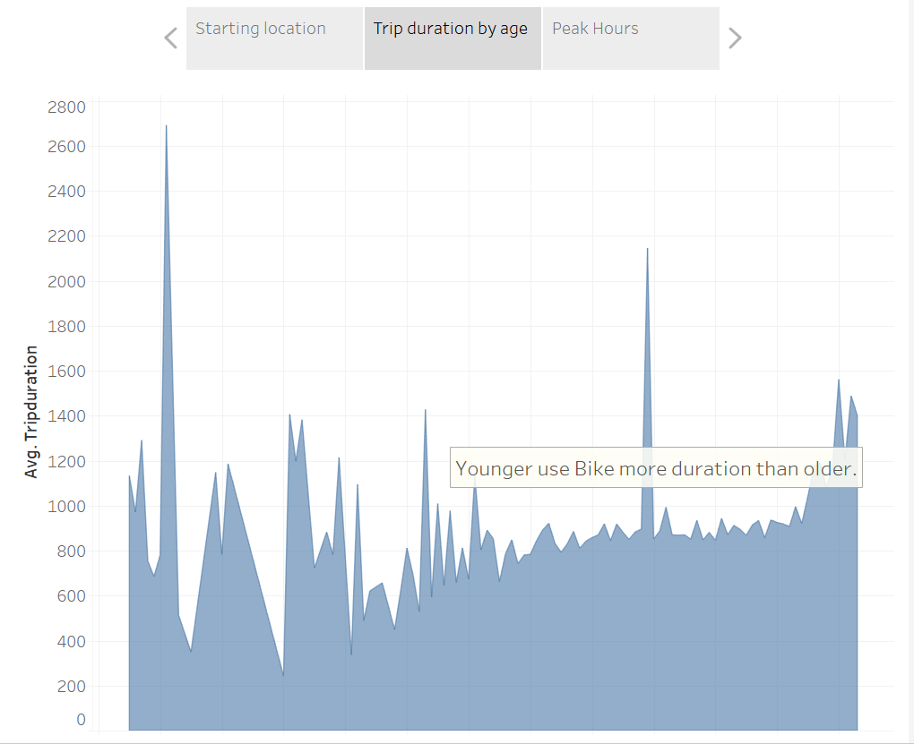

# bikesharing

## 1.0 Overview of the statistical analysis:
    In this statistical analysis, we need to find out the Bike Sharing business possibility in the Des Moines city. We have obtained Citi Bike sharing data for New York City for a bike-sharing company which is similar kind of Bike sharing business. We need to analyses New York City's Bike Sharing data and would like to see how this data could be useful in new business proposal for Des Monies city. This business proposal would be presented to investors to decide if this project has potential to be implemented.

## 2.0 Results:
   It is suggested to use analytic tool "Tableau" to analyze New York City's  bike-sharing data. Tableau is a very good tool for data visualization. It can generate visual very quickly and efficiatly without need of coding. Following visuals are prepared from the available New York City's Bike sharing data.
   
   a. Checkout Time by Gender:
  
    From above mentioned visual it is observed that, most of the Bike rides are male which is 73.65%.
[link to dashboard](https://public.tableau.com/app/profile/ajs5972/viz/TableauAssignmentstory-1/Story1)

    b. Checkout Times for Users:
 
    From above mentioned visual it is observed that, most of thee Bike rides trip duration is up to 60 minutes.
[link to dashboard](https://public.tableau.com/app/profile/ajs5972/viz/TableauAssignmentstory-2/Story1)

    c. Trips by Weekday for Each Hour:

    From above mentioned visual it is observed that, maximum numbers of bikes are shared during 5 PM to 7 PM on Thursday, Tuesday and Monday.

[link to dashboard](https://public.tableau.com/app/profile/ajs5972/viz/TableauAssignmentstory-3/Story1?publish=yes)

    d. Trips by Gender (Weekday per Hour):
.png)
    From above mentioned visual it is observed that, maximum male bike riders are shared the bikes.
[link to dashboard](https://public.tableau.com/app/profile/ajs5972/viz/TableauAssignmentstory-4/Story1?publish=yes)

    e. User Trips by Gender by Weekday

    From above mentioned visual it is observed that maximum male subscribers have maximum Bike rides.
[link to dashboard](https://public.tableau.com/app/profile/ajs5972/viz/TableauAssignmentstory-5/Story1?publish=yes)

    f. Top Starting Locations:

    From above mentioned visual it is observed that starting points where we have observed high traffic at certain locations.
[link to dashboard](https://public.tableau.com/app/profile/ajs5972/viz/TableauModuleSotry-1/NYCStory?publish=yes)

    g. Average Trip Duration:

    From above mentioned visual, it is observed that younger use Bike more duration than older.
[link to dashboard](https://public.tableau.com/app/profile/ajs5972/viz/TableauModuleSotry-2/NYCStory?publish=yes)

## 3.0 Summary:
    On base of all the visuals we have observed that Bike sharing business is highly depend on,
        A. Gender of the Bike riders.
        B. # of subscribers.
        C. Particular time duration.
    It is also suggested to provide financial data as well as Bikes maintenance expenditure for future analysis.

